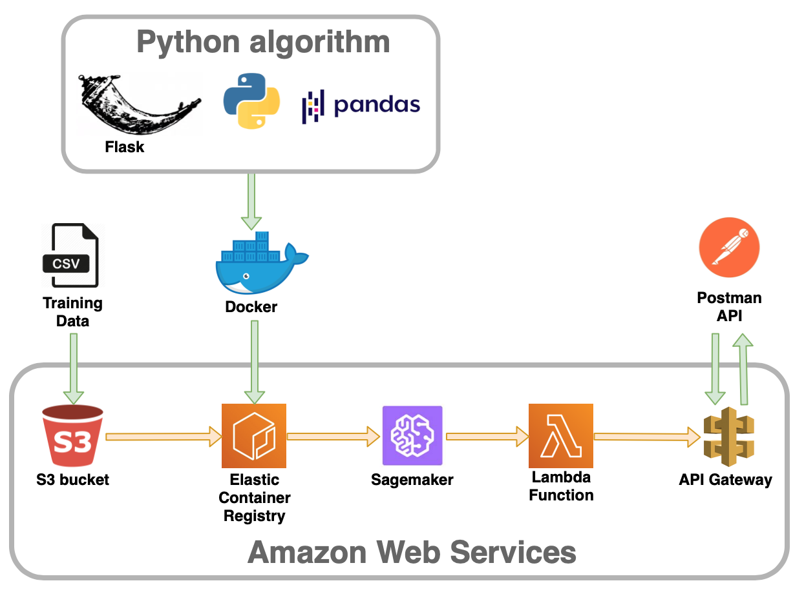

# Deploying a recommender system on the cloud
### How to train and deploy a recommender system on AWS with custom containers

This project covers the end-to-end process of training and deploying a recommender system on AWS, following a typical use case such as predicting movie ratings from users.

File structure:
- __/data__: Input datasets with users, movies and ratings information.
- __/img__: Images for the project.
- __/model__: Directory where the recommender model is saved after training.
- __/src__: Sourcecode of the algorithm and API configuration files (more details in src/README.md)
- __build_and_push.sh__: Script provided by AWS to automatically build and push the Docker image to Elastic Container Registry (ECR).
- __Dockerfile__: Text file which contains the set of commands for building the Docker image.

Article here: ?????????????
